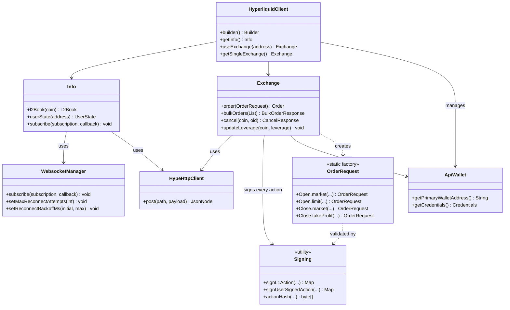

**Languages:** [中文](README.zh-CN.md)

# Hyperliquid Java SDK

[](https://central.sonatype.com/artifact/io.github.heiye115/hyperliquid-java-sdk)
[](LICENSE)
[](pom.xml)
[](https://github.com/heiye115/hyperliquid-java-sdk)
[](https://github.com/heiye115/hyperliquid-java-sdk/issues)

A pure Java SDK for the Hyperliquid decentralized exchange: market data, WebSocket subscriptions, orders, signing, and
multi-wallet management.

## Table of Contents

- [Overview](#overview)
- [Architecture](#architecture)
- [Features](#features)
- [Installation](#installation)
- [Quick Start](#quick-start)
- [Configuration](#configuration)
- [API Reference](#api-reference)
- [Contribution](#contribution)
- [License](#license)

## Overview

- Unified client to access Info (market data) and Exchange (trading) with one builder.
- Multi-wallet management: register multiple private keys and switch Exchange per-wallet.
- Robust WebSocket manager with auto-reconnect, backoff, and network monitoring.
- EIP-712 signing compatible with Hyperliquid actions, MessagePack-based hashing.

## Architecture



### Core Components

The SDK is organized into four architectural layers:

**Client Layer**: `HyperliquidClient` serves as the unified entry point with builder pattern configuration. It manages
multiple wallet credentials (`ApiWallet`) and provides seamless access to both Info and Exchange APIs. The multi-wallet
design allows developers to switch between different trading accounts without recreating client instances.

**API Layer**: `Info` handles market data queries via REST and real-time WebSocket subscriptions. `Exchange` manages all
trading operations including orders, cancellations, and leverage adjustments. `OrderRequest` provides static factory
methods (Open/Close helpers) to simplify order construction with type-safe builders.

**Network Layer**: `HypeHttpClient` wraps HTTP communication with intelligent error classification (4xx/5xx).
`WebsocketManager` implements robust connection handling with automatic reconnection, exponential backoff, and network
availability monitoring.

**Security Layer**: `Signing` is the core security component implementing EIP-712 typed data signing for Hyperliquid
actions. It uses MessagePack-based hashing to generate action signatures, supporting both L1 actions (trading
operations) and user-signed actions (fund transfers, approvals).

### Key Workflows

**Trading Flow**: Developers create orders using `OrderRequest.Open.limit(...)` or similar factory methods. When
`Exchange.order(req)` is called, the Exchange validates the request and invokes `Signing.signL1Action` to generate an
EIP-712 signature. The signed payload is sent via `HypeHttpClient.post` to the `/exchange` endpoint, returning an
`Order` object with execution status and order ID.

**WebSocket Flow**: Real-time data subscriptions begin with `Info.subscribe(subscription, callback)`. The
`WebsocketManager` maintains persistent connections with periodic ping/pong heartbeats. On disconnection, it triggers
exponential backoff retries while monitoring network availability. Upon successful reconnection, all active
subscriptions are automatically re-established, ensuring zero data loss for critical market feeds.

**Multi-Wallet Management**: `HyperliquidClient` stores multiple `ApiWallet` instances indexed by address. Developers
can switch contexts using `useExchange(address)` to execute trades from different accounts. Each Exchange instance is
bound to a specific wallet's credentials, with the `Signing` module handling per-wallet signature generation.

## Features

- Market data: `l2Book`, candles, user fills, open orders, clearinghouse state.
- Trading: limit/market/trigger orders, bulk orders, modify/cancel, leverage and margin updates.
- WebSocket: channel subscriptions with callback and error listener, ping/pong and auto-reconnect.
- Signing: EIP-712 typed data signing for L1 and user actions, MessagePack hashing.
- Utilities: JSON conversions, constants for mainnet/testnet URLs.

## Installation

- Requirements: JDK `21+`, Maven or Gradle.
- Maven:

```xml

<dependency>
    <groupId>io.github.heiye115</groupId>
    <artifactId>hyperliquid-java-sdk</artifactId>
    <version>0.2.3</version>
</dependency>
```

- Gradle (Groovy):

```gradle
implementation 'io.github.heiye115:hyperliquid-java-sdk:0.2.3'
```

## Quick Start

- Use environment variables for private keys; never hardcode secrets.

```java
import com.fasterxml.jackson.databind.JsonNode;
import io.github.hyperliquid.sdk.HyperliquidClient;
import io.github.hyperliquid.sdk.apis.Exchange;
import io.github.hyperliquid.sdk.apis.Info;
import io.github.hyperliquid.sdk.model.info.L2Book;
import io.github.hyperliquid.sdk.model.order.Order;
import io.github.hyperliquid.sdk.model.order.OrderRequest;
import io.github.hyperliquid.sdk.model.order.Tif;
import io.github.hyperliquid.sdk.utils.HypeError;
import io.github.hyperliquid.sdk.utils.JSONUtil;

public class Demo {
    public static void main(String[] args) {
        // Recommended: Use API Wallet for better security
        // API Wallet: Sub-wallet authorized by main wallet, with limited permissions, main private key not exposed
        // Main Private Key: Direct use of main wallet private key, full control, higher risk
        String primaryWalletAddress = "";  // Primary wallet address
        String apiWalletPrivateKey = "";   // API wallet private key

        // Build client with API Wallet (Recommended)
        // First parameter: Primary wallet address (for querying account state)
        // Second parameter: API wallet private key (for signing trading requests)
        HyperliquidClient client = HyperliquidClient.builder()
                .testNetUrl()
                .addApiWallet(primaryWalletAddress, apiWalletPrivateKey)
                .build();

        // Alternative: Build client with main private key (Not recommended for production)
        // String pk = System.getenv("HYPERLIQUID_PRIVATE_KEY");
        // HyperliquidClient client = HyperliquidClient.builder()
        //         .testNetUrl()
        //         .addPrivateKey(pk)
        //         .build();

        Info info = client.getInfo();
        L2Book book = info.l2Book("ETH");
        System.out.println("Best bid: " + book.getLevels().get(0).get(0).getPx());

        Exchange ex = client.getExchange();
        OrderRequest req = OrderRequest.Open.limit(Tif.GTC, "ETH", true, "0.001", "3500.0");
        try {
            Order order = ex.order(req);
            System.out.println("Order status: " + order.getStatus());
        } catch (HypeError e) {
            System.err.println("Order failed: " + e.getMessage());
        }

        JsonNode sub = JSONUtil.convertValue(java.util.Map.of("type", "l2Book", "coin", "ETH"), JsonNode.class);
        info.subscribe(sub, msg -> System.out.println("WS msg: " + msg));
        try {
            Thread.sleep(10000);
        } catch (InterruptedException ignored) {
        }
        info.closeWs();
    }
}
```

## Configuration

- Builder options (`HyperliquidClient.java:91`):
    - `baseUrl(String)` and `testNetUrl()` use `Constants` mainnet/testnet (`Constants.java:11`, `Constants.java:16`).
    - `addPrivateKey(String)` and `addPrivateKeys(List<String>)` register wallets by private key.
    - `skipWs(boolean)` disables WebSocket manager for `Info` when true.
    - `timeout(int)` sets OkHttp timeouts.
    - `okHttpClient(OkHttpClient)` injects a custom client.
- WebSocket tuning via `Info`:
    - `setMaxReconnectAttempts(int)` (`src/main/java/io/github/hyperliquid/sdk/apis/Info.java:897`).
    - `setNetworkCheckIntervalSeconds(int)` (`src/main/java/io/github/hyperliquid/sdk/apis/Info.java:910`).
    - `setReconnectBackoffMs(initialMs, maxMs)` (`src/main/java/io/github/hyperliquid/sdk/apis/Info.java:924`).

## API Reference

- HyperliquidClient
    - `builder()` (`src/main/java/io/github/hyperliquid/sdk/HyperliquidClient.java:91`)
    - `getInfo()` (`src/main/java/io/github/hyperliquid/sdk/HyperliquidClient.java:46`)
    - `useExchange(privateKey)` (`src/main/java/io/github/hyperliquid/sdk/HyperliquidClient.java:63`)
    - `getAddress(privateKey)` (`src/main/java/io/github/hyperliquid/sdk/HyperliquidClient.java:74`)
- Info
    - `l2Book(String coin)` (`src/main/java/io/github/hyperliquid/sdk/apis/Info.java:225`)
    - `subscribe(JsonNode, MessageCallback)` (`src/main/java/io/github/hyperliquid/sdk/apis/Info.java:838`)
    - User/account state: `clearinghouseState`, `userState`, `spotClearinghouseState` (see `Info.java:591`,
      `Info.java:617`, `Info.java:628`).
- Exchange
    - `order(OrderRequest)` and builder overload (`src/main/java/io/github/hyperliquid/sdk/apis/Exchange.java:208`,
      `Exchange.java:127`).
    - `bulkOrders(List<OrderRequest>)` (`src/main/java/io/github/hyperliquid/sdk/apis/Exchange.java:253`).
    - `cancel(String coin, long oid)` (`src/main/java/io/github/hyperliquid/sdk/apis/Exchange.java:264`).
    - `cancelByCloid(String coin, Cloid)` (`src/main/java/io/github/hyperliquid/sdk/apis/Exchange.java:283`).
    - `modifyOrder(String coin, long oid, OrderRequest)` (
      `src/main/java/io/github/hyperliquid/sdk/apis/Exchange.java:302`).
    - `updateLeverage(String coin, boolean crossed, int leverage)` (
      `src/main/java/io/github/hyperliquid/sdk/apis/Exchange.java:100`).
    - Dex Abstraction: `agentEnableDexAbstraction()` and `userDexAbstraction(user, enabled)` (
      `src/main/java/io/github/hyperliquid/sdk/apis/Exchange.java:386`, `Exchange.java:409`).
    - Close position methods:
        - `closePositionMarket(String coin)` - Close all position at market price.
        - `closePositionMarket(String coin, Double sz, Double slippage, Cloid)` - Partial close with custom slippage.
        - `closePositionLimit(Tif, String coin, double limitPx, Cloid)` - Close position at limit price.
        - `closeAllPositions()` - Close all positions across all coins in a single batch order.
    - Slippage config: `setDefaultSlippage(double)` (`src/main/java/io/github/hyperliquid/sdk/apis/Exchange.java:1407`)
      and `setDefaultSlippage(String coin, double)` (`src/main/java/io/github/hyperliquid/sdk/apis/Exchange.java:1417`).
    - OrderRequest
        - `Open.market(...)` - Market order to open position (no InstrumentType parameter for perps).
        - `Open.limit(...)` - Limit order to open position (supports TIF strategies).
        - `Open.breakoutAbove(...)` - Breakout long entry (trigger order when price breaks above).
        - `Open.breakoutBelow(...)` - Breakout short entry (trigger order when price breaks below).
        - `Open.spotMarketBuy/Sell(...)` - Spot market orders (prefix with "spot").
        - `Open.spotLimitBuy/Sell(...)` - Spot limit orders.
        - `Close.market(...)` - Market order to close position (auto-infer direction).
        - `Close.limit(...)` - Limit order to close position.
        - `Close.marketAll(...)` - Close entire position for a coin.
        - `Close.takeProfit(...)` - Take profit order (trigger when price breaks above).
        - `Close.stopLoss(...)` - Stop loss order (trigger when price breaks below).
        - All order methods support optional `cloid` parameter for order tracking.
- WebsocketManager
    - `MessageCallback` interface (`src/main/java/io/github/hyperliquid/sdk/websocket/WebsocketManager.java:106`).
    - Connection listener and error listener hooks.
- HypeHttpClient
    - `post(String, Object)` with error classification (
      `src/main/java/io/github/hyperliquid/sdk/utils/HypeHttpClient.java:37`).

## Contribution

- Fork the repo and create feature branches.
- Run `mvn -q -DskipTests package` locally; ensure Java 21.
- Add unit tests for critical logic where applicable.
- Open a Pull Request with a clear description and references.

## License

- Apache License 2.0. See `LICENSE`.

## Contact

Contact the author via:

- WeChat: heiye5050
- Email: heiye115@gmail.com
- Telegram: @heiye5050
