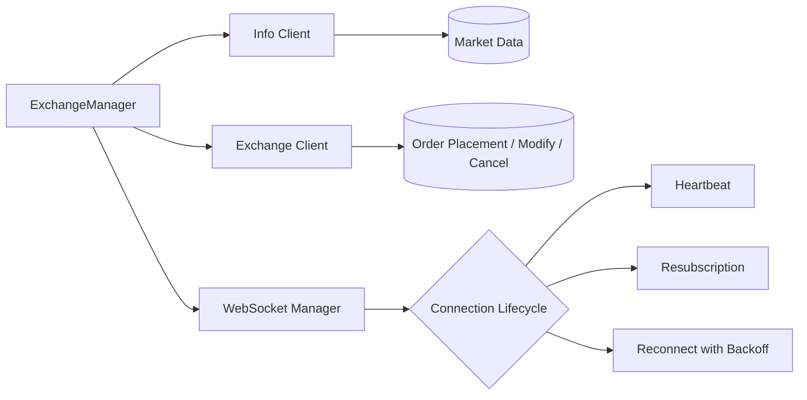
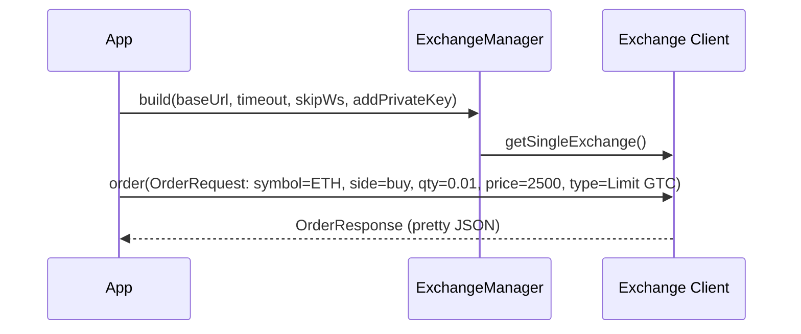

**Languages:** [中文](README.zh-CN.md)

# Hyperliquid Java SDK

A Software Development Kit (SDK) for the Hyperliquid decentralized exchange.

## Table of Contents

- Features
- Project Overview (legacy anchor)
- Installation
- Usage
    - Quick Start
    - Compile & Run Demos
- Configuration
- Examples
- Architecture
- Style Guide & Terminology
- Version & Synchronization
- Verification Checklist
- License

## Features

- Info client: market data, order books, user state
- Exchange client: order placement, bulk orders, cancel/modify
- ExchangeManager: manage multiple wallet credentials and unified Info access for simpler trading flows
- WebSocket manager: connection lifecycle, heartbeat, resubscription, reconnect with backoff

## Project Overview

This section has been reorganized into the Features module above for clarity. See Features for a high-level description
of the SDK components.

## Installation

Prerequisites:

- Java 21 or later
- Maven 3.8+

Build from source:

```bash
mvn -q -DskipTests=true clean package
mvn -q dependency:copy-dependencies
```

Use as a dependency (Maven):

If you are integrating this SDK into your own project, add the following dependency to your root-level pom.xml:

```xml

<dependency>
    <groupId>io.github.heiye115</groupId>
    <artifactId>hyperliquid-java-sdk</artifactId>
    <version>0.2.0</version>
    <!-- Ensure your project uses Java 21+ -->
</dependency>
```

Notes:

- Ensure your project uses Java 21+.
- If you previously built from source, you can remove local module references and rely on the Maven artifact directly.

## Usage

This README focuses on ExchangeManager-related examples.

### Quick Start

```java
import io.github.hyperliquid.sdk.ExchangeManager;
import io.github.hyperliquid.sdk.client.ExchangeClient;
import io.github.hyperliquid.sdk.client.InfoClient;
import io.github.hyperliquid.sdk.model.order.*;
import io.github.hyperliquid.sdk.utils.Constants;

/**
 * Class description: Initialize ExchangeManager on testnet and perform a sample order.
 * Note: To place a real order, set environment variable HL_PK (private key).
 * If HL_PK is not set, the demo prints mids and skips order placement.
 */
public class QuickExchangeManagerDemo {
    /**
     * Method description: Application entry point; demonstrates ExchangeManager initialization and a basic order flow.
     * 1. Read HL_PK from environment variables.
     * 2. Build ExchangeManager (testnet URL, timeout, skip WS, private key).
     * 3. Print BTC mid price.
     * 4. If a private key is provided, place a sample limit buy order for ETH.
     */
    public static void main(String[] args) {
        // Read HL_PK from environment variables
        String pk = System.getenv("HL_PK");

        // Build ExchangeManager: set testnet URL, request timeout, skip WebSocket, add private key
        // Use a placeholder key if empty to avoid real orders
        ExchangeManager manager = ExchangeManager.builder()
                .baseUrl(Constants.TESTNET_API_URL)
                .timeout(10)           // Request timeout (seconds), example value 10
                .skipWs(true)          // Skip WebSocket (not needed for this demo)
                .addPrivateKey(pk == null || pk.isBlank() ?
                        "0x0000000000000000000000000000000000000000000000000000000000000000" : pk)
                .build();

        // Fetch market info and print BTC mid price
        InfoClient info = manager.getInfo();
        System.out.println("BTC mid: " + info.allMids().getOrDefault("BTC", "N/A"));

        // If a real private key is provided, place a sample limit order
        if (pk != null && !pk.isBlank()) {
            ExchangeClient ex = manager.getSingleExchange();

            // Order type: Limit, time-in-force GTC (Good-Till-Cancelled)
            OrderType type = new OrderType(new LimitOrderType("Gtc"), null);

            // Order request: Buy ETH, quantity 0.01, price 2500.0
            OrderRequest req = new OrderRequest("ETH", true, 0.01, 2500.0, type, false, null);

            // Execute order and print response (pretty output)
            System.out.println(ex.order(req).toPrettyString());
        } else {
            System.out.println("No private key provided; skipping order placement.");
        }
    }
}
```

Minimum version: ExchangeManager requires SDK version >= 0.2.0.

### Compile & Run Demos (Windows PowerShell)

```bash
mvn -q -DskipTests=true clean package
mvn -q dependency:copy-dependencies
javac -cp target/classes;target/dependency/* \
  examples/ExchangeManagerBasicExample.java \
  examples/ExchangeManagerScenarioExample.java \
  examples/ExchangeManagerErrorHandlingExample.java \
  examples/QuickExchangeManagerDemoCN.java

# Without a private key, demos will skip real orders
java -cp .;examples;target/classes;target/dependency/* ExchangeManagerBasicExample
java -cp .;examples;target/classes;target/dependency/* ExchangeManagerErrorHandlingExample
java -cp .;examples;target/classes;target/dependency/* QuickExchangeManagerDemoCN
```

## Configuration

The ExchangeManager builder supports several options commonly used in examples:

| Option        | Type    | Default     | Description                                                        |
|---------------|---------|-------------|--------------------------------------------------------------------|
| baseUrl       | String  | Testnet URL | API base URL (e.g., `Constants.TESTNET_API_URL`)                   |
| timeout       | int     | Example: 10 | Request timeout (seconds). Example uses 10                         |
| skipWs        | boolean | false/true  | Skip WebSocket subscription for simple demo flows                  |
| addPrivateKey | String  | —           | Add a private key for trading. Use placeholder to skip real orders |

Environment variables:

- HL_PK — private key used for signing orders. Without this, demos only print mids and skip real placements.

## Examples

ExchangeManager-related demos under `examples/`:

- ExchangeManagerBasicExample.java — initialize the manager and perform a safe order demo
- ExchangeManagerScenarioExample.java — common trading flows: order, bulk order, cancel/modify
- ExchangeManagerErrorHandlingExample.java — handle missing/invalid keys and manager errors
- QuickExchangeManagerDemoCN.java — 中文注释版快速演示（与 README 示例思路一致）

## Architecture

High-level modules and data flow:



Typical order placement sequence:



## Style Guide & Terminology

- Use consistent terms: ExchangeManager, Info client, Exchange client, WebSocket manager.
- Code examples include class-level and method-level comments to clarify responsibilities and steps.
- Keep code fences with language annotations (e.g., `java`, `bash`, `xml`) for proper syntax highlighting on
  GitHub/GitLab.

## Version & Synchronization

- Minimum version: ExchangeManager requires SDK version >= 0.2.0.
- Keep README aligned with SDK API changes. When updating builder options or example flows in code, update the
  Configuration and Usage sections accordingly.
- The examples under `examples/` are the source of truth for runnable flows. If example signatures change, reflect those
  updates here.

## Verification Checklist

- Examples compile and run with the commands provided (Windows PowerShell)
- Document structure is clear and navigation works (English/Chinese links)
- Code samples are properly formatted with comments and language annotations
- Anchors from the original document remain valid (Project Overview, Installation, Usage, Verification Checklist,
  License)
- No residual references to removed or outdated examples

## License

Apache License 2.0. See `LICENSE` at the project root.

Copyright notice:

- Copyright (c) 2025 Hyperliquid Java SDK contributors
- Distributed under Apache 2.0 on an "AS IS" basis without warranties or conditions of any kind
