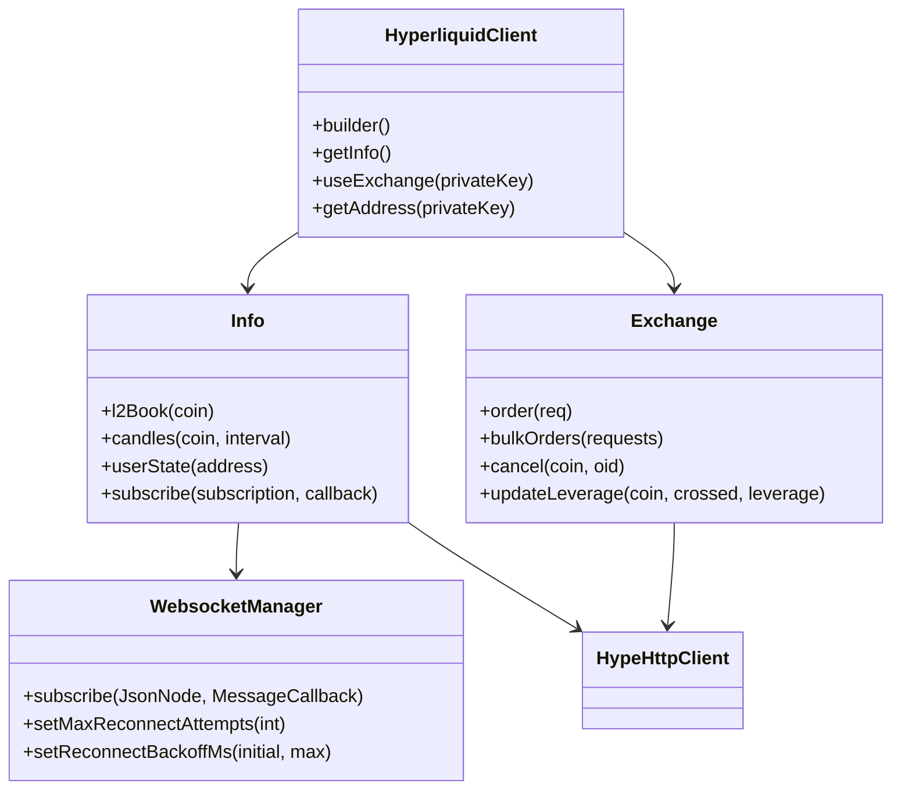

**Languages:** [中文](README.zh-CN.md)

# Hyperliquid Java SDK

[](https://central.sonatype.com/artifact/io.github.heiye115/hyperliquid-java-sdk)
[](LICENSE)
[](pom.xml)
[](https://github.com/heiye115/hyperliquid-java-sdk)
[](https://github.com/heiye115/hyperliquid-java-sdk/issues)

A pure Java SDK for the Hyperliquid decentralized exchange: market data, WebSocket subscriptions, orders, signing, and multi-wallet management.

## Table of Contents
- [Overview](#overview)
- [Architecture](#architecture)
- [Features](#features)
- [Installation](#installation)
- [Quick Start](#quick-start)
- [Configuration](#configuration)
- [API Reference](#api-reference)
- [Contribution](#contribution)
- [License](#license)

## Overview
- Unified client to access Info (market data) and Exchange (trading) with one builder.
- Multi-wallet management: register multiple private keys and switch Exchange per-wallet.
- Robust WebSocket manager with auto-reconnect, backoff, and network monitoring.
- EIP-712 signing compatible with Hyperliquid actions, MessagePack-based hashing.

## Architecture


## Features
- Market data: `l2Book`, candles, user fills, open orders, clearinghouse state.
- Trading: limit/market/trigger orders, bulk orders, modify/cancel, leverage and margin updates.
- WebSocket: channel subscriptions with callback and error listener, ping/pong and auto-reconnect.
- Signing: EIP-712 typed data signing for L1 and user actions, MessagePack hashing.
- Utilities: JSON conversions, constants for mainnet/testnet URLs.

## Installation
- Requirements: JDK `21+`, Maven or Gradle.
- Maven:
```xml
<dependency>
  <groupId>io.github.heiye115</groupId>
  <artifactId>hyperliquid-java-sdk</artifactId>
  <version>0.2.0</version>
</dependency>
```
- Gradle (Groovy):
```gradle
implementation 'io.github.heiye115:hyperliquid-java-sdk:0.2.0'
```
- Alternative: JitPack (if not on Central yet):
```gradle
repositories { maven { url 'https://jitpack.io' } }
implementation 'com.github.heiye115:hyperliquid-java-sdk:main-SNAPSHOT'
```

## Quick Start
- Use environment variables for private keys; never hardcode secrets.
```java
import com.fasterxml.jackson.databind.JsonNode;
import io.github.hyperliquid.sdk.HyperliquidClient;
import io.github.hyperliquid.sdk.apis.Exchange;
import io.github.hyperliquid.sdk.apis.Info;
import io.github.hyperliquid.sdk.model.info.L2Book;
import io.github.hyperliquid.sdk.model.order.Order;
import io.github.hyperliquid.sdk.model.order.OrderRequest;
import io.github.hyperliquid.sdk.model.order.Tif;
import io.github.hyperliquid.sdk.utils.HypeError;
import io.github.hyperliquid.sdk.utils.JSONUtil;

public class Demo {
  public static void main(String[] args) {
    String pk = System.getenv("HYPERLIQUID_PRIVATE_KEY");
    if (pk == null || pk.isBlank()) throw new IllegalStateException("Set HYPERLIQUID_PRIVATE_KEY");

    HyperliquidClient client = HyperliquidClient.builder()
        .testNetUrl()
        .addPrivateKey(pk)
        .build();

    Info info = client.getInfo();
    L2Book book = info.l2Book("ETH");
    System.out.println("Best bid: " + book.getLevels().get(0).get(0).getPx());

    Exchange ex = client.useExchange(pk);
    OrderRequest req = OrderRequest.createDefaultPerpLimitOrder(Tif.GTC, "ETH", true, 0.001, 3500.0);
    try {
      Order order = ex.order(req);
      System.out.println("Order status: " + order.getStatus());
    } catch (HypeError e) {
      System.err.println("Order failed: " + e.getMessage());
    }

    JsonNode sub = JSONUtil.convertValue(java.util.Map.of("type","l2Book","coin","ETH"), JsonNode.class);
    info.subscribe(sub, msg -> System.out.println("WS msg: " + msg));
    try { Thread.sleep(10000); } catch (InterruptedException ignored) {}
    info.closeWs();
  }
}
```

## Configuration
- Builder options (`HyperliquidClient.java:91`):
  - `baseUrl(String)` and `testNetUrl()` use `Constants` mainnet/testnet (`Constants.java:11`, `Constants.java:16`).
  - `addPrivateKey(String)` and `addPrivateKeys(List<String>)` register wallets by private key.
  - `skipWs(boolean)` disables WebSocket manager for `Info` when true.
  - `timeout(int)` sets OkHttp timeouts.
  - `okHttpClient(OkHttpClient)` injects a custom client.
  - `enableDebugLogs()` enables package-level DEBUG logs.
- WebSocket tuning via `Info`:
  - `setMaxReconnectAttempts(int)` (`src/main/java/io/github/hyperliquid/sdk/apis/Info.java:897`).
  - `setNetworkCheckIntervalSeconds(int)` (`src/main/java/io/github/hyperliquid/sdk/apis/Info.java:910`).
  - `setReconnectBackoffMs(initialMs, maxMs)` (`src/main/java/io/github/hyperliquid/sdk/apis/Info.java:924`).

## API Reference
- HyperliquidClient
  - `builder()` (`src/main/java/io/github/hyperliquid/sdk/HyperliquidClient.java:91`)
  - `getInfo()` (`src/main/java/io/github/hyperliquid/sdk/HyperliquidClient.java:46`)
  - `useExchange(privateKey)` (`src/main/java/io/github/hyperliquid/sdk/HyperliquidClient.java:63`)
  - `getAddress(privateKey)` (`src/main/java/io/github/hyperliquid/sdk/HyperliquidClient.java:74`)
- Info
  - `l2Book(String coin)` (`src/main/java/io/github/hyperliquid/sdk/apis/Info.java:225`)
  - `subscribe(JsonNode, MessageCallback)` (`src/main/java/io/github/hyperliquid/sdk/apis/Info.java:838`)
  - User/account state: `clearinghouseState`, `userState`, `spotClearinghouseState` (see `Info.java:591`, `Info.java:617`, `Info.java:628`).
- Exchange
  - `order(OrderRequest)` and builder overload (`src/main/java/io/github/hyperliquid/sdk/apis/Exchange.java:208`, `Exchange.java:127`).
  - `bulkOrders(List<OrderRequest>)` (`src/main/java/io/github/hyperliquid/sdk/apis/Exchange.java:253`).
  - `cancel(String coin, long oid)` (`src/main/java/io/github/hyperliquid/sdk/apis/Exchange.java:264`).
  - `cancelByCloid(String coin, Cloid)` (`src/main/java/io/github/hyperliquid/sdk/apis/Exchange.java:283`).
  - `modifyOrder(String coin, long oid, OrderRequest)` (`src/main/java/io/github/hyperliquid/sdk/apis/Exchange.java:302`).
  - `updateLeverage(String coin, boolean crossed, int leverage)` (`src/main/java/io/github/hyperliquid/sdk/apis/Exchange.java:100`).
  - Dex Abstraction: `agentEnableDexAbstraction()` and `userDexAbstraction(user, enabled)` (`src/main/java/io/github/hyperliquid/sdk/apis/Exchange.java:386`, `Exchange.java:409`).
- WebsocketManager
  - `MessageCallback` interface (`src/main/java/io/github/hyperliquid/sdk/websocket/WebsocketManager.java:106`).
  - Connection listener and error listener hooks.
- HypeHttpClient
  - `post(String, Object)` with error classification (`src/main/java/io/github/hyperliquid/sdk/utils/HypeHttpClient.java:37`).

## Contribution
- Fork the repo and create feature branches.
- Follow Java naming and Clean Code practices; keep Controllers thin in integrations and put business logic in Services when embedding this SDK in MVC systems.
- Run `mvn -q -DskipTests package` locally; ensure Java 21.
- Add unit tests for critical logic where applicable.
- Open a Pull Request with a clear description and references.

## License
- Apache License 2.0. See `LICENSE`.

## Notes
- Never commit real private keys. Prefer environment variables and secure secret managers.
- Mainnet and testnet base URLs are defined in `Constants` (`src/main/java/io/github/hyperliquid/sdk/utils/Constants.java:11`, `:16`).
