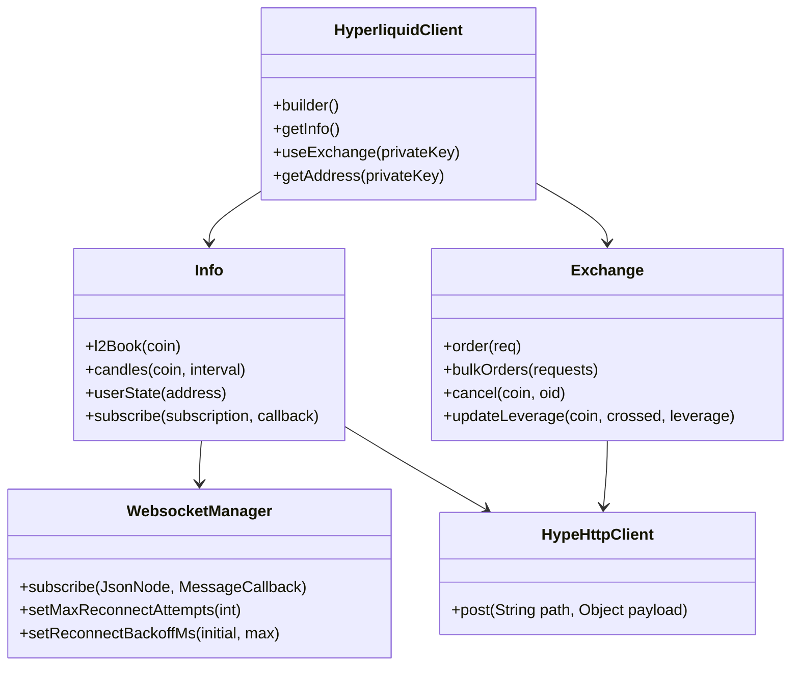

**语言切换：** [English](README.md)

# Hyperliquid Java SDK

[](https://central.sonatype.com/artifact/io.github.heiye115/hyperliquid-java-sdk)
[](LICENSE)
[](pom.xml)
[](https://github.com/heiye115/hyperliquid-java-sdk)
[](https://github.com/heiye115/hyperliquid-java-sdk/issues)

纯 Java 的 Hyperliquid 去中心化交易所 SDK：行情查询、WebSocket 订阅、下单与签名、多钱包管理。

## 目录

- [项目概述](#项目概述)
- [架构设计](#架构设计)
- [功能特性](#功能特性)
- [安装部署](#安装部署)
- [5分钟快速开始](#5分钟快速开始)
- [配置选项](#配置选项)
- [API 参考](#api-参考)
- [贡献指南](#贡献指南)
- [许可协议](#许可协议)

## 项目概述

- 统一客户端入口，分别提供 Info（行情）与 Exchange（交易）能力。
- 支持多钱包私钥注册与切换，按钱包维度获取 Exchange 实例。
- WebSocket 管理器具备断线重连、指数退避与网络监控。
- 兼容 Hyperliquid 行动的 EIP-712 签名，基于 MessagePack 的动作哈希。

## 架构设计



## 功能特性

- 行情查询：`l2Book`、K线、用户成交、未成交订单、清算所状态等。
- 交易能力：限价/市价/触发单、批量下单、修改/撤单、杠杆与保证金更新。
- WebSocket：频道订阅、消息回调与错误监听、心跳与断线重连。
- 签名能力：L1 与用户签名（EIP-712 Typed Data）、MessagePack 哈希。
- 常用工具：JSON 转换、主网/测试网 URL 常量。

## 安装部署

- 前置要求：JDK `21+`，Maven 或 Gradle。
- Maven 依赖：

```xml

<dependency>
    <groupId>io.github.heiye115</groupId>
    <artifactId>hyperliquid-java-sdk</artifactId>
    <version>0.2.0</version>
</dependency>
```

- Gradle（Groovy）：

```gradle
implementation 'io.github.heiye115:hyperliquid-java-sdk:0.2.0'
```

- 备选方案（若尚未发布到中央仓库）：JitPack

```gradle
repositories { maven { url 'https://jitpack.io' } }
implementation 'com.github.heiye115:hyperliquid-java-sdk:main-SNAPSHOT'
```

## 5分钟快速开始

- 强烈建议使用环境变量注入私钥，切勿硬编码敏感信息。

```java
import com.fasterxml.jackson.databind.JsonNode;
import io.github.hyperliquid.sdk.HyperliquidClient;
import io.github.hyperliquid.sdk.apis.Exchange;
import io.github.hyperliquid.sdk.apis.Info;
import io.github.hyperliquid.sdk.model.info.L2Book;
import io.github.hyperliquid.sdk.model.order.Order;
import io.github.hyperliquid.sdk.model.order.OrderRequest;
import io.github.hyperliquid.sdk.model.order.Tif;
import io.github.hyperliquid.sdk.utils.HypeError;
import io.github.hyperliquid.sdk.utils.JSONUtil;

public class QuickStart {
    public static void main(String[] args) {
        String pk = System.getenv("HYPERLIQUID_PRIVATE_KEY");
        if (pk == null || pk.isBlank()) throw new IllegalStateException("请设置 HYPERLIQUID_PRIVATE_KEY");

        HyperliquidClient client = HyperliquidClient.builder()
                .testNetUrl()
                .addPrivateKey(pk)
                .build();

        Info info = client.getInfo();
        L2Book book = info.l2Book("ETH");
        System.out.println("买一价: " + book.getLevels().get(0).get(0).getPx());

        Exchange ex = client.getSingleExchange();
        OrderRequest req = OrderRequest.Open.limit(Tif.GTC, "ETH", true, 0.001, 3500.0);
        try {
            Order order = ex.order(req);
            System.out.println("下单状态: " + order.getStatus());
        } catch (HypeError e) {
            System.err.println("下单失败: " + e.getMessage());
        }

        JsonNode sub = JSONUtil.convertValue(java.util.Map.of("type", "l2Book", "coin", "ETH"), JsonNode.class);
        info.subscribe(sub, msg -> System.out.println("WS消息: " + msg));
        try {
            Thread.sleep(10000);
        } catch (InterruptedException ignored) {
        }
        info.closeWs();
    }
}
```

## 配置选项

- 构建器选项（`src/main/java/io/github/hyperliquid/sdk/HyperliquidClient.java:91`）：
    - `baseUrl(String)` 与 `testNetUrl()` 基于 `Constants` 主网/测试网（
      `src/main/java/io/github/hyperliquid/sdk/utils/Constants.java:11`, `:16`）。
    - `addPrivateKey(String)` / `addPrivateKeys(List<String>)` 注册钱包私钥。
    - `skipWs(boolean)` 关闭 Info 的 WebSocket 管理。
    - `timeout(int)` 配置 OkHttp 超时。
    - `okHttpClient(OkHttpClient)` 注入自定义客户端。
    - `enableDebugLogs()` 打开包级 DEBUG 日志。
- WebSocket 调优（`Info`）：
    - `setMaxReconnectAttempts(int)`（`src/main/java/io/github/hyperliquid/sdk/apis/Info.java:897`）。
    - `setNetworkCheckIntervalSeconds(int)`（`src/main/java/io/github/hyperliquid/sdk/apis/Info.java:910`）。
    - `setReconnectBackoffMs(initialMs, maxMs)`（`src/main/java/io/github/hyperliquid/sdk/apis/Info.java:924`）。

## API 参考

- HyperliquidClient
    - `builder()`（`src/main/java/io/github/hyperliquid/sdk/HyperliquidClient.java:91`）
    - `getInfo()`（`src/main/java/io/github/hyperliquid/sdk/HyperliquidClient.java:46`）
    - `useExchange(privateKey)`（`src/main/java/io/github/hyperliquid/sdk/HyperliquidClient.java:63`）
    - `getAddress(privateKey)`（`src/main/java/io/github/hyperliquid/sdk/HyperliquidClient.java:74`）
- Info
    - `l2Book(String coin)`（`src/main/java/io/github/hyperliquid/sdk/apis/Info.java:225`）
    - `subscribe(JsonNode, MessageCallback)`（`src/main/java/io/github/hyperliquid/sdk/apis/Info.java:838`）
    - 用户/账户状态：`clearinghouseState`、`userState`、`spotClearinghouseState`（见 `Info.java:591`, `Info.java:617`,
      `Info.java:628`）。
- Exchange
    - `order(OrderRequest)` 及带 builder 重载（`src/main/java/io/github/hyperliquid/sdk/apis/Exchange.java:208`,
      `Exchange.java:127`）。
    - `bulkOrders(List<OrderRequest>)`（`src/main/java/io/github/hyperliquid/sdk/apis/Exchange.java:253`）。
    - `cancel(String coin, long oid)`（`src/main/java/io/github/hyperliquid/sdk/apis/Exchange.java:264`）。
    - `cancelByCloid(String coin, Cloid)`（`src/main/java/io/github/hyperliquid/sdk/apis/Exchange.java:283`）。
    - `modifyOrder(String coin, long oid, OrderRequest)`（
      `src/main/java/io/github/hyperliquid/sdk/apis/Exchange.java:302`）。
    - `updateLeverage(String coin, boolean crossed, int leverage)`（
      `src/main/java/io/github/hyperliquid/sdk/apis/Exchange.java:100`）。
    - Dex Abstraction：`agentEnableDexAbstraction()` / `userDexAbstraction(user, enabled)`（
      `src/main/java/io/github/hyperliquid/sdk/apis/Exchange.java:386`, `Exchange.java:409`）。
    - `closePositionAtMarketAll(String coin)`（`src/main/java/io/github/hyperliquid/sdk/apis/Exchange.java:1429`）。
    - `closePositionLimitAll(Tif, String coin, double limitPx, Cloid)`（
      `src/main/java/io/github/hyperliquid/sdk/apis/Exchange.java:1443`）。
    - 滑点配置：`setDefaultSlippage(double)`（`src/main/java/io/github/hyperliquid/sdk/apis/Exchange.java:1407`）与
      `setDefaultSlippage(String coin, double)`（`src/main/java/io/github/hyperliquid/sdk/apis/Exchange.java:1417`）。
    - OrderRequest
        - `Open.limit(...)`（`src/main/java/io/github/hyperliquid/sdk/model/order/OrderRequest.java:123`）。
        - `Open.market(...)`（`src/main/java/io/github/hyperliquid/sdk/model/order/OrderRequest.java:200`）。
        - `Open.trigger(...)`（`src/main/java/io/github/hyperliquid/sdk/model/order/OrderRequest.java:219`）。
        - `Close.limit(...)`（`src/main/java/io/github/hyperliquid/sdk/model/order/OrderRequest.java:331`）。
        - `Close.market(String coin, Double sz, Cloid)`（
          `src/main/java/io/github/hyperliquid/sdk/model/order/OrderRequest.java:379`）。
        - `Close.positionAtMarketAll(String coin)`（
          `src/main/java/io/github/hyperliquid/sdk/model/order/OrderRequest.java:493`）。
- WebsocketManager
    - `MessageCallback` 接口（`src/main/java/io/github/hyperliquid/sdk/websocket/WebsocketManager.java:106`）。
    - 支持连接状态监听与回调异常监听。
- HypeHttpClient
    - `post(String, Object)` 携带 4xx/5xx 错误分类（
      `src/main/java/io/github/hyperliquid/sdk/utils/HypeHttpClient.java:37`）。

## 贡献指南

- Fork 仓库并创建功能分支。
- 遵循 Java 命名与 Clean Code 规范；在 MVC 系统中集成时保持 Controller 轻薄、将业务逻辑沉淀在 Service 层。
- 本地执行 `mvn -q -DskipTests package`，确保使用 Java 21。
- 为关键逻辑补充必要的单元测试。
- 提交 Pull Request，描述清晰、引用充分。

## 许可协议

- Apache License 2.0，详见 `LICENSE`。

## 作者联系方式：

- 微信：heiye5050
- 邮箱：heiye115@gmail.com
- Telegram：@heiye5050
