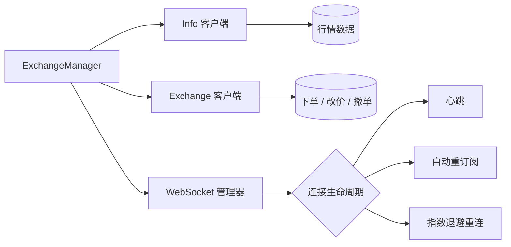
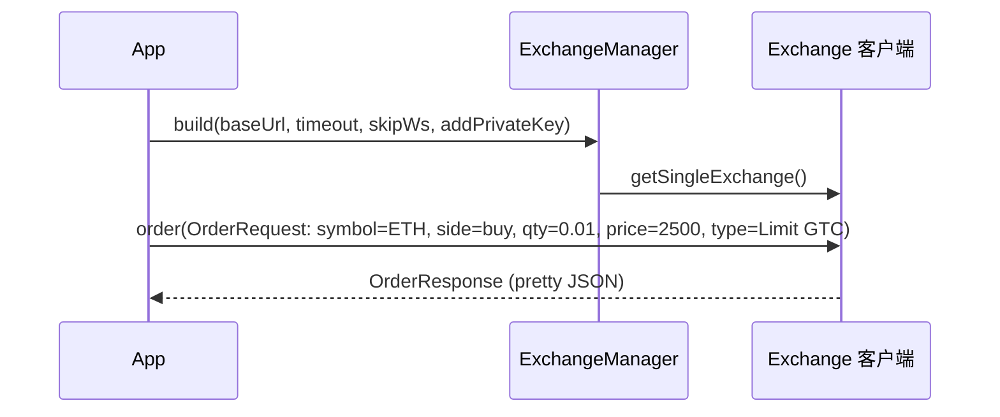

**Languages:** [English](README.md)

# Hyperliquid Java SDK

Hyperliquid 去中心化交易所的软件开发工具包 (SDK)。

## 目录

- 特性
- 项目概述（保留锚点）
- 安装
- 使用
    - 快速开始
    - 编译与运行示例
- 配置
- 示例
- 架构
- 风格与术语
- 版本与同步
- 验证清单
- 许可证

## 特性

- Info 客户端：行情、订单簿、用户状态
- Exchange 客户端：下单、批量下单、撤单/改价
- ExchangeManager：统一管理多个钱包凭证并复用单个 Info 客户端，简化常见交易流程
- WebSocket 管理器：连接生命周期、心跳、自动重订阅、指数退避重连

## 项目概述

为提高可读性，原“项目概述”已重组为上方“特性”模块。请参见“特性”获取 SDK 组件的高级说明。

## 安装

环境要求：

- Java 21 或更高版本
- Maven 3.8+

从源码构建：

```bash
mvn -q -DskipTests=true clean package
mvn -q dependency:copy-dependencies
```

作为依赖使用（Maven）：

如果你要在自己的项目中集成本 SDK，请在项目根目录的 pom.xml 中添加以下依赖配置：

```xml
<dependency>
    <groupId>io.github.heiye115</groupId>
    <artifactId>hyperliquid-java-sdk</artifactId>
    <version>0.2.0</version>
    <!-- 请确保项目使用 Java 21+ -->
</dependency>
```

说明：

- 请确保项目使用的 JDK 版本为 21 或更高。
- 如果之前通过源码构建并在本地引用模块，现在可直接使用 Maven 依赖以简化集成。

## 使用

本文档重点展示 ExchangeManager 相关示例。

### 快速开始

```java
import io.github.hyperliquid.sdk.ExchangeManager;
import io.github.hyperliquid.sdk.exchange.ExchangeClient;
import io.github.hyperliquid.sdk.info.InfoClient;
import io.github.hyperliquid.sdk.model.order.*;
import io.github.hyperliquid.sdk.utils.Constants;

/**
 * 类说明：使用 ExchangeManager 在测试网初始化并进行示例下单。
 * 注意：如需真实下单请设置环境变量 HL_PK（私钥）。若未设置 HL_PK，示例仅打印中间价并跳过下单。
 */
public class QuickExchangeManagerDemoCN {
    /**
     * 方法说明：应用入口，演示 ExchangeManager 初始化与基本下单流程。
     * 1. 从环境变量读取 HL_PK；
     * 2. 构建 ExchangeManager（测试网地址、超时、跳过 WS、私钥配置）；
     * 3. 打印 BTC 中间价；
     * 4. 当存在私钥时，演示限价买入 ETH 的下单请求。
     */
    public static void main(String[] args) {
        // 读取环境变量 HL_PK
        String pk = System.getenv("HL_PK");

        // 构建 ExchangeManager：设置测试网地址、请求超时、跳过 WebSocket、添加私钥（若为空则使用占位私钥避免真实下单）
        ExchangeManager manager = ExchangeManager.builder()
                .baseUrl(Constants.TESTNET_API_URL)
                .timeout(10)           // 请求超时（秒），示例值为 10
                .skipWs(true)          // 跳过 WebSocket（示例场景无需订阅）
                .addPrivateKey(pk == null || pk.isBlank() ?
                        "0x0000000000000000000000000000000000000000000000000000000000000000" : pk)
                .build();

        // 获取行情信息并打印 BTC 中间价
        InfoClient info = manager.getInfo();
        System.out.println("BTC 中间价: " + info.allMids().getOrDefault("BTC", "N/A"));

        // 若存在真实私钥，演示一次限价下单
        if (pk != null && !pk.isBlank()) {
            ExchangeClient ex = manager.getSingleExchange();

            // 订单类型：限价、有效期 GTC（Good-Till-Cancelled）
            OrderType type = new OrderType(new LimitOrderType("Gtc"), null);

            // 下单请求：买入 ETH，数量 0.01，价格 2500.0
            OrderRequest req = new OrderRequest("ETH", true, 0.01, 2500.0, type, false, null);

            // 执行下单并打印返回结果（美化输出）
            System.out.println(ex.order(req).toPrettyString());
        } else {
            System.out.println("未提供私钥，跳过真实下单示例。");
        }
    }
}
```

最低版本：使用 ExchangeManager 需要 SDK 版本 >= 0.2.0。

### 编译与运行示例（Windows PowerShell）

```bash
mvn -q -DskipTests=true clean package
mvn -q dependency:copy-dependencies
javac -cp target/classes;target/dependency/* \
  examples/ExchangeManagerBasicExample.java \
  examples/ExchangeManagerScenarioExample.java \
  examples/ExchangeManagerErrorHandlingExample.java \
  examples/QuickExchangeManagerDemoCN.java

# 无私钥运行（示例将跳过真实下单）
java -cp .;examples;target/classes;target/dependency/* ExchangeManagerBasicExample
java -cp .;examples;target/classes;target/dependency/* ExchangeManagerErrorHandlingExample
java -cp .;examples;target/classes;target/dependency/* QuickExchangeManagerDemoCN
```

## 配置

ExchangeManager 的 builder 常用选项如下：

| 选项            | 类型      | 默认值         | 说明                                      |
|---------------|---------|-------------|-----------------------------------------|
| baseUrl       | String  | Testnet URL | API 基地址（例如 `Constants.TESTNET_API_URL`） |
| timeout       | int     | 示例：10       | 请求超时（秒），示例使用 10                         |
| skipWs        | boolean | false/true  | 是否跳过 WebSocket 订阅（用于简单演示场景）             |
| addPrivateKey | String  | —           | 添加用于交易的私钥；使用占位私钥可避免真实下单                 |

环境变量：

- HL_PK — 用于签名订单的私钥。未设置时示例仅打印中间价并跳过真实下单。

## 示例

`examples/` 目录中的 ExchangeManager 相关示例：

- ExchangeManagerBasicExample.java —— 初始化管理器并进行安全下单演示
- ExchangeManagerScenarioExample.java —— 典型交易流程：下单、批量下单、撤单/改价
- ExchangeManagerErrorHandlingExample.java —— 错误处理：缺失/非法私钥与异常示范
- QuickExchangeManagerDemoCN.java —— 中文注释版快速演示（与 README 示例思路一致）

## 架构

模块与数据流高层示意：



典型下单流程时序：



## 风格与术语

- 术语统一：ExchangeManager、Info 客户端、Exchange 客户端、WebSocket 管理器。
- 所有代码示例包含类注释与方法注释，明确职责与关键步骤。
- 代码块保持语言标注（`java`、`bash`、`xml`、`mermaid`）以获得平台高亮效果。

## 版本与同步

- 最低版本：ExchangeManager 需要 SDK 版本 >= 0.2.0。
- README 与 SDK API 需保持同步；当 builder 选项或示例流程更新时，请同步更新“配置”和“使用”章节。
- `examples/` 目录中的示例是可运行流程的真实来源；如示例签名或流程变动，请及时在 README 中反映。

## 验证清单

- 示例可按提供的命令编译运行（Windows PowerShell）
- 文档结构清晰，中英文导航可用（README.md / README.zh-CN.md）
- 代码样例格式规范，包含必要注释与语言标注
- 保留原文档锚点（项目概述、安装、使用、验证清单、许可证）
- 无残余过时示例的引用

## 许可证

Apache License 2.0。详见项目根目录 `LICENSE` 文件。

版权声明：

- Copyright (c) 2025 Hyperliquid Java SDK contributors
- 按 Apache 2.0 许可“现状”分发，不附带任何明示或暗示的担保或条件。

